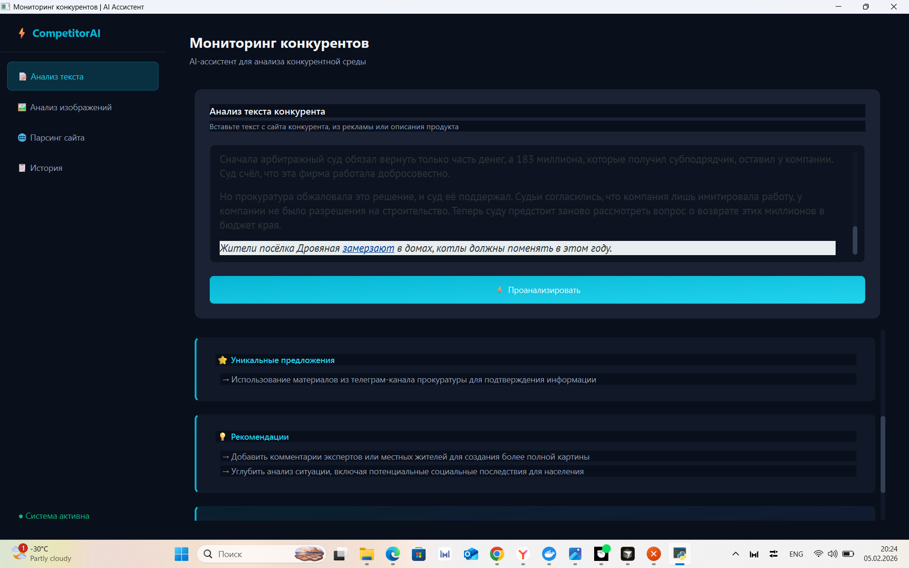

# Enterprise AI-платформа мониторинга конкурентов

**Система мониторинга и аналитики конкурентов для медиа-холдингов и агентств**

Платформа автоматизирует мониторинг новостных порталов и медиа-ресурсов: собирает контент, анализирует тексты с помощью LLM и визуал — через Vision API, формирует структурированные аналитические выводы. Ручной мониторинг заменяется системным анализом редакционной политики, тональности, тематики и визуального стиля конкурентов с сохранением истории и возможностью работы через веб-интерфейс или десктоп-клиент.

Ориентирована на **медиа-холдинги**, **маркетинговые и креативные агентства**, **региональные СМИ** и **digital-команды**, которым нужна регулярная аналитика по конкурентам и обоснование контент-стратегии.

---

## 📌 Статус проекта

| Параметр | Значение |
|----------|----------|
| **Версия** | 1.0.0 |
| **Статус** | Готов к внедрению (production-ready) |
| **API** | REST, документирован (Swagger / ReDoc) |
| **Клиенты** | Веб (SPA) + десктоп (PyQt6) |
| **Лицензия** | MIT |

Платформа готова к развёртыванию в корпоративной среде: поддерживаются локальный запуск и развёртывание на сервере с настройкой окружения через `.env`.

---

## Бизнес-задача (Business Problem)

| Проблема | Влияние |
|----------|--------|
| **Ручной мониторинг конкурентов** | Отнимает много времени, результаты разрознены и не систематизированы. |
| **Нет системного анализа редакционной политики** | Сложно понять, на чём фокус конкурентов и как они подают новости. |
| **Нет автоматического сравнения контента и визуала** | Тексты и дизайн оцениваются выборочно, а не в масштабе. |
| **Сложно отслеживать изменения стратегий конкурентов** | Сдвиги в тоне, темах или формате замечают слишком поздно. |

Платформа решает это за счёт автоматизации сбора, AI-анализа (текст + изображения) и хранения данных, чтобы команды могли фокусироваться на решениях, а не на рутине мониторинга.

---

## 💼 Стратегическая ценность для бизнеса

- **Медиа-холдинги** — выравнивание редакционной стратегии на основе данных о конкурентах, а не интуиции; быстрая реакция на смену повестки.
- **Агентства** — бенчмаркинг контента и креатива для клиентов, обоснованные рекомендации по контент-стратегии и визуалу.
- **Региональные СМИ** — понимание позиционирования локальных конкурентов, поиск ниш и отличий.
- **Digital-команды** — регулярные срезы по конкурентам для продуктовых и контент-решений без ручного сбора данных.
- **Снижение затрат** — автоматизация заменяет часы ручного мониторинга; история анализов даёт возможность отслеживать тренды во времени.

---

## Решение (Solution)

Сквозной поток:

**Пользователь** → **REST API** → **Парсер (Selenium)** → **LLM (GPT-4o)** → **Vision API** → **Хранилище** → **Дашборд / Десктоп-клиент**

- **Массовый анализ статей** — разбор множества URL конкурентов за один запуск.
- **Выявление тем и тональности** — определение основных тем и тона из текста.
- **Анализ визуального стиля** — скриншоты страниц анализируются на композицию, стиль и UX.
- **Сравнение конкурентов** — сопоставление выводов по настроенным порталам.
- **Сохранение истории** — последние анализы хранятся для быстрого доступа и просмотра трендов.

---

## Архитектура (Architecture)

| Слой | Технология | Назначение |
|------|------------|------------|
| **Backend** | FastAPI | REST API, маршрутизация, оркестрация. |
| **Парсинг** | Selenium | Сбор страниц, скриншоты, извлечение заголовков и текста. |
| **AI (текст)** | OpenAI GPT-4o | Редакционная политика, сильные/слабые стороны, рекомендации. |
| **AI (визуал)** | OpenAI Vision API | Визуальный стиль, вёрстка и подача контента. |
| **Хранилище** | Локальная БД / JSON | Сохранённая история анализов. |
| **Клиент** | PyQt6 + веб (SPA) | Десктоп и веб для запуска анализов и просмотра результатов. |
| **Конфигурация** | `.env` | API-ключи, эндпоинты, порты. |

---

## Технологический стек (Tech Stack)

- **Python**
- **FastAPI** — REST API
- **OpenAI API** — GPT-4o (текст + vision)
- **Selenium** — автоматизация браузера и парсинг
- **PyQt6** — десктоп-клиент
- **python-dotenv** — конфигурация через переменные окружения
- **REST** — стандартная HTTP API-архитектура

---

## Возможности (Key Features)

- **Автоматический сбор данных по конкурентам** — плановый или по запросу парсинг настроенных порталов.
- **AI-анализ текста** — темы, тон, сильные/слабые стороны, рекомендации.
- **Анализ визуального контента** — оценка скриншотов по стилю и структуре.
- **Выявление трендов** — история для сравнения анализов во времени.
- **История анализов** — хранение и быстрый доступ к последним отчётам.
- **Поддержка десктоп-клиента** — приложение на PyQt6 для запуска анализов без браузера.
- **Готовность API к продакшену** — понятные эндпоинты, CORS, логирование, документация (Swagger/ReDoc).

---

## Возможности применения (Use Cases)

- **Медиа-холдинги** — мониторинг изданий-конкурентов и выравнивание собственной редакционной стратегии.
- **Маркетинговые агентства** — бенчмаркинг контента и креатива конкурентов клиентов.
- **Региональные СМИ** — отслеживание локальных конкурентов и поиск отличий.
- **Стратегический анализ** — отчёты на основе данных о действиях конкурентов.
- **Digital-команды** — регулярные срезы по конкурентам для продуктовых и контент-решений.

---

## 🧪 Пример структурированного отчёта (LLM output)

Ответ API после анализа текста или страницы конкурента возвращается в виде структурированного JSON. Пример вывода модели для редакционного анализа:

```json
{
  "strengths": [
    "Чёткая структура главной: блок топа, тематические рубрики, минимум визуального шума",
    "Сильный акцент на локальной повестке и событиях региона",
    "Использование подзаголовков и лидов облегчает сканирование"
  ],
  "weaknesses": [
    "Перегруженность рекламными блоками в первой экранной зоне",
    "Нет явного раздела «Мнения» или экспертных колонок",
    "Слабая визуальная иерархия в блоке «Главное»"
  ],
  "unique_offers": [
    "Отдельный блок «Живые новости» с обновлениями в реальном времени",
    "Интеграция с телеграм-каналом с дублированием заголовков"
  ],
  "recommendations": [
    "Усилить экспертный контент и авторские колонки для дифференциации",
    "Сократить рекламу выше сгиба или выделить её визуально",
    "Добавить краткие дайджесты по темам для быстрого потребления"
  ],
  "summary": "Портал ориентирован на оперативную региональную новостную ленту с акцентом на событийность. Сильные стороны — структура и локальная повестка; слабые — перегруженность рекламой и недостаток аналитики. Рекомендуется развивать экспертный слой и улучшать визуальную иерархию."
}
```

Эти поля используются в веб-интерфейсе и десктоп-клиенте для отображения карточек анализа и сравнения нескольких конкурентов.

---

## 👁 Пример Vision-анализа

При анализе скриншота главной страницы (или загруженного изображения) Vision API возвращает оценку визуального стиля и маркетинговые инсайты. Пример ответа:

```json
{
  "description": "Главная страница регионального новостного портала: логотип слева, горизонтальное меню, центральная колонка с лентой новостей, боковая панель с рекламой и анонсами.",
  "marketing_insights": [
    "В первой экранной зоне доминируют криминал и происшествия — формируется драматичный информационный тон",
    "Используются кликабельные карточки с крупными фото — упор на визуальное потребление",
    "Рекламные блоки визуально не отделены от контента — риск снижения доверия к редакционному контенту"
  ],
  "visual_style_score": 6,
  "visual_style_analysis": "Современная, но перегруженная вёрстка. Хорошая читаемость шрифтов и контраст, однако избыток элементов выше сгиба и однотипные карточки снижают визуальную иерархию. Цветовая схема консервативная, без выраженного фирменного акцента.",
  "recommendations": [
    "Упростить первый экран: один доминирующий материал + 3–4 второстепенных",
    "Визуально отделить рекламу (рамка, подпись «Реклама») от редакционных блоков",
    "Ввести акцентный цвет для ключевых рубрик или спецпроектов"
  ]
}
```

По таким отчётам можно сравнивать визуальную подачу нескольких порталов и формулировать рекомендации по дизайну и UX.

---

## 📸 Скриншоты

| Описание | Файл |
|----------|------|
| Веб-интерфейс: главный экран и выбор типа анализа |![Telegram dialog] `docs/screenshots/web-dashboard.png` |
| Результат анализа текста: сильные/слабые стороны, рекомендации | |
| Результат Vision-анализа: оценка стиля и инсайты | .png) |
| Парсинг сайта: ввод URL и отчёт по странице |![Telegram dialog] `docs/screenshots/parse-demo.png` |
| История запросов и быстрый доступ к прошлым отчётам |![Telegram dialog] `docs/screenshots/history.png` |
| Десктоп-клиент (PyQt6): запуск анализа и просмотр сводки |![Telegram dialog] `docs/screenshots/desktop-client.png` |


---

## 🚀 Варианты развёртывания

### Локальное развёртывание (разработка и тесты)

Подходит для одного рабочего места или демо.

1. Клонировать репозиторий и перейти в каталог проекта:
   ```bash
   git clone https://github.com/finnik82-75/ai-competitor-monitoring-multimodal-telegram-assistant.git
   cd ai-competitor-monitoring-multimodal-telegram-assistant
   ```
2. Создать виртуальное окружение и установить зависимости:
   ```bash
   python -m venv venv
   venv\Scripts\activate   # Windows
   # source venv/bin/activate   # Linux/macOS
   pip install -r requirements.txt
   ```
3. Настроить `.env` (см. раздел «Конфигурация окружения»).
4. Запустить backend:
   ```bash
   uvicorn backend.main:app --reload
   ```
5. Открыть в браузере: **http://localhost:8000** (веб-интерфейс), **http://localhost:8000/docs** (Swagger).

Опционально — десктоп-клиент:
   ```bash
   pip install -r desktop/requirements.txt
   cd desktop && python main.py
   ```

### Развёртывание на сервере (production)

Для медиа-холдингов и агентств, где платформой пользуются несколько сотрудников или отдел.

1. **Сервер**: Linux (рекомендуется Ubuntu 22.04 LTS), Python 3.10+, Chrome/Chromium для Selenium.
2. **Клонирование и окружение** — так же, как локально; при необходимости использовать отдельного системного пользователя и каталог, например `/opt/competitor-monitor`.
3. **Конфигурация**:
   - Заполнить `.env` (API-ключи, при необходимости `API_HOST=0.0.0.0`, `API_PORT=8000`).
   - В `backend/config.py` задать `competitor_urls` для нужных порталов.
4. **Запуск как сервис** (systemd):
   - Создать unit-файл для `uvicorn backend.main:app --host 0.0.0.0 --port 8000`.
   - Включить автозапуск: `systemctl enable competitor-monitor`.
5. **Обратный прокси**: перед приложением поставить Nginx (или аналог) для HTTPS, раздачи статики и при необходимости базовой аутентификации.
6. **Ограничение доступа**: настроить firewall, при необходимости VPN или корпоративную аутентификацию на уровне прокси.

В результате платформа доступна по корпоративному URL (например `https://competitor-monitor.company.ru`), с централизованной историей анализов и возможностью запуска массового парсинга конкурентов по расписанию (cron + вызов `POST /parse_competitors`).

---

## Как запустить (How to Run)

### 1. Клонирование и окружение

```bash
git clone https://github.com/finnik82-75/ai-competitor-monitoring-multimodal-telegram-assistant.git
cd ai-competitor-monitoring-multimodal-telegram-assistant

python -m venv venv
venv\Scripts\activate   # Windows
# source venv/bin/activate   # Linux/macOS

pip install -r requirements.txt
```

Опционально — десктоп-клиент:

```bash
pip install -r desktop/requirements.txt
```

### 2. Конфигурация окружения

Создайте файл `.env` в корне проекта:

```env
OPENAI_API_KEY=your_key_here
```

При использовании OpenAI-совместимых прокси (например ProxyAPI):

```env
PROXY_API_KEY=your_key_here
```

Опционально: `OPENAI_MODEL`, `OPENAI_VISION_MODEL`, `API_HOST`, `API_PORT`. Пример — в `env.example.txt`.

### 3. Настройка конкурентов

В `backend/config.py` задайте `competitor_urls` для нужных порталов.

### 4. Запуск backend

```bash
uvicorn backend.main:app --reload
```

Или через лаунчер:

```bash
python run.py
```

- API: **http://localhost:8000**
- Swagger: **http://localhost:8000/docs**
- ReDoc: **http://localhost:8000/redoc**

### 5. (Опционально) Десктоп-клиент

При запущенном backend:

```bash
cd desktop
python main.py
```

---

## Позиционирование (Portfolio Positioning)

Проект демонстрирует:

- **Проектирование AI-систем** — объединение LLM и Vision в одном продукте.
- **Архитектуру backend** — FastAPI, сервисы, чёткие границы API.
- **Интеграцию LLM** — структурированные промпты и разбор для редакционного анализа.
- **Интеграцию Vision API** — оценка сайтов конкурентов по изображениям.
- **Автоматизированную контент-аналитику** — от URL до пригодных к действию выводов.
- **Бизнес-ориентированную реализацию AI** — под реальные задачи мониторинга и стратегии.

---

## Лицензия

MIT License. Приветствуются контрибуции и issue.
